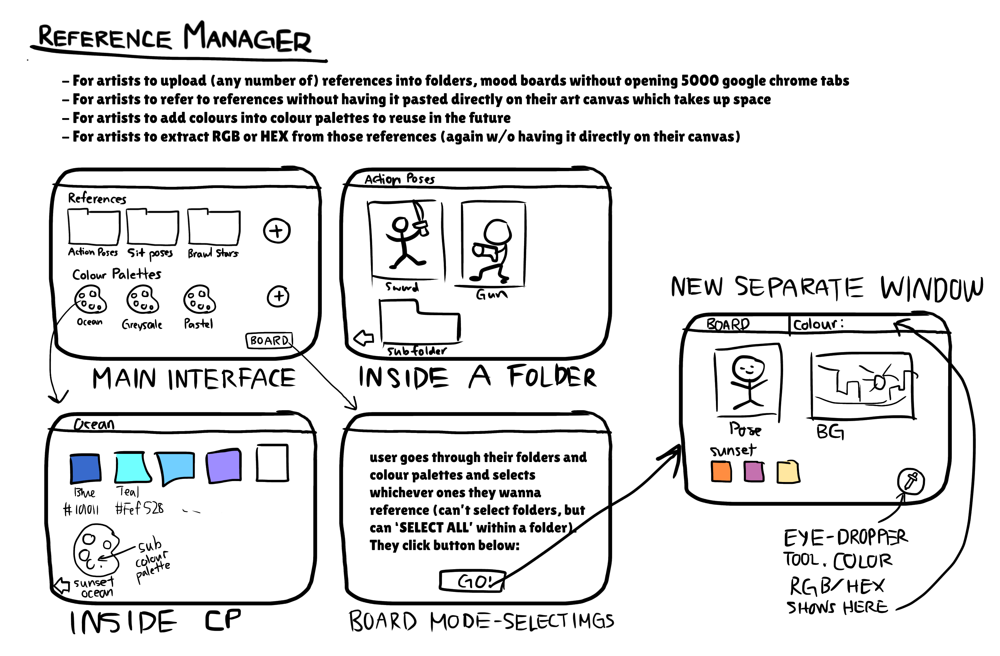

# My Personal Project - Reference Manager

Tammie Liang, 52445806

## About the project
The application is for artists to better manage any pictures and colour palettes
they use as a reference for their art.

SKETCH OF IDEA: 
- **What will the application do?**

The application will allow the user to upload reference pictures they use often (such as action poses, backgrounds, characters, etc.)
and organize them into folders for easier access. Folders can also be within folders.
The user can also create and save colour palettes (eg. greyscale colour palette, sunset, pastel, etc.)
to refer to when colouring. For example, if I am creating an artwork that has a sunset atmosphere,
I may choose to create a colour palette called "Sunset" and save colours that work well together
like orange, purple, red, yellow, etc. to refer to when coloring. I can then refer to the same
colour palette in future art pieces that have a sunset atmosphere.

EXTRA FEATURE IF TIME ALLOWS: The application will allow users to select a few reference photos
or colour palettes of their choosing for the artwork they're currently working on,
then pull it out onto a separate window. In that separate window, the user can use
an "eye-dropper" tool to select pixels on the pictures, and get their HEX
or RGB values so they can use it in their own artwork.
- **Who will use it?**

Artists (mainly digital artists, but traditional artists too (although the colour palette
feature will probably be of less use to traditional artists since they can't directly refer to
rgb's and hex codes))

- **Why is this project of interest to you?**

I LOVE art, and I want to make artists' lives just a liiittle easier (no, I am NOT looking at you, AI art).
Having to open 5000 google chrome tabs to search up
an image for each tab, and have to jump between tabs as they try to look at multiple
references at once is an absolute headache. Hence, having it all in one place will be
much easier. And, saving too many pictures onto your camera roll 1) takes up space,
and 2) will be drowned out by other photos.
Copy and pasting the references directly onto their canvas is an alternative,
but it ends up taking a lot of space on the canvas, and if the artist chooses to zoom in
at a part of their drawing, then they can't see the reference unless they keep zooming in
and out.
More of a personal reason, I draw on my phone, so directly copy and pasting references onto
my canvas board takes up too much space on such a small screen, and drawing on a phone means
I have to always be super zoomed in on my drawing so zooming in and out is VERY inconvenient
just to look at some reference pictures.
That's why I search up references on my laptop instead.

## User stories
- As a user, I want to be able to upload images I use for art references. (DONE)
- As a user, I want to be able to create and name art folders (DONE)
- As a user, I want to be able to insert those references into those folders (DONE)
- As a user, I want to be able to have subfolders within folders (DONE)
- As a user, I want to be able to delete and rename art folders (DONE)
- As a user, I want to be able to delete any reference image uploaded (DONE)
- As a user, I want to be able to create and name a colour palette (DONE)
- As a user, I want to be able to add an arbitrary number of colours with specific hex values into a colour palette(DONE)
- As a user, I want to be able to add an arbitrary number of sub-colour palettes within a non-sub colour palette (DONE)
- As a user, I want to be able to rename a colour palette (DONE)
- As a user, I want to be bale to delete a colour palette (DONE)
- As a user, I want to be able to add colours in an existing colour palette (DONE)
- As a user, I want to be able to delete colours in an existing colour palette (DONE)
- As a user, I want to be able to rename colours in an existing colour paletee (DONE)
- As a user, I want to be able to delete sub-colour palettes in an existing colour palette (DONE)
- EXTRA FEATURE IF TIME ALLOWS: As a user, I want to be able to select different images and colour palettes of my choosing,
and pull them out to display into a separate window
- EXTRA FEATURE IF TIME ALLOWS: As a user, I want to be able to extract exact hex and rbg values off a picture's pixel
## DATA PERSISTENCE USER STORIES
- As a user, I want to be able to save all the colour palettes I've created, including the colours and sub-colour palettes in each colour palette when I enter "s"
- As a user, I want to be able to load all the saved colour palettes, including the colours and sub-colour palettes in each colour palette when I enter "l"
## Citations:
- Java Swing GUI tutorial https://www.youtube.com/watch?v=Kmgo00avvEw&t=11742s Java Swing GUI tutorial
- How to use ImageIcon on button https://stackoverflow.com/questions/4898584/java-using-an-image-as-a-button
- How to scale an image icon https://www.youtube.com/watch?v=G3QJqbYuJ7M
- How to remove everything from a panel https://stackoverflow.com/questions/38349445/how-to-delete-all-components-in-a-jpanel-dynamically
- How to fix BoyLayout can't be shared error https://stackoverflow.com/questions/761341/error-upon-assigning-layout-boxlayout-cant-be-shared
- How to let user upload image https://stackoverflow.com/questions/14142932/gui-with-java-gui-builder-for-uploading-an-image-and-displaying-to-a-panelinsid
- How to let user upload image https://docs.oracle.com/javase/tutorial/uiswing/components/filechooser.html
- How to call a method when application closes https://stackoverflow.com/questions/13800621/call-a-method-when-application-closes

- edX Basics 1 Practice LongFormProblemsStarter (used it to reference how tabs worked)
- Phase 2 JsonSerializationDemoProject (used it for data persistence)
- Phase 4 AlarmSystem project Event and EventLog classes

# Instructions for Grader

- You can add colours to a colour palette while creating the palette by going to the Create Colour Palette tab, and adding colors
- You can display each colour's information of all the colours in a certain colour palette by clicking the palette in the Menu Tab
- You can locate my visual component by launching the application. It's also in the main menu, and pop up windows for each palette or reference folder
- You can save the state of my application by clicking the green save icon in the bottom right
- You can reload the state of my application by clicking the blue refresh icon in the bottom right